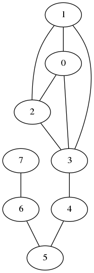

# Clique problem

## Description
The clique problem is the computational NP-complete problem of finding cliques (subsets of vertices, all adjacent to each other, also called complete subgraphs) in a graph. 

[Clique problem at wikipedia](https://en.wikipedia.org/wiki/Clique_problem)

## Solutions

### 1. Brute force solution
1. Find all combinations of vertecies in graph
2. Сheck for each combination of vertices if the subgraph is a clique

### 2. Bron–Kerbosch algorithm
[Bron-Kerbosh algorithm at wikipedia](https://en.wikipedia.org/wiki/Bron%E2%80%93Kerbosch_algorithm)

The basic form of the Bron–Kerbosch algorithm is a recursive backtracking algorithm that searches for all maximal cliques in a given graph G. More generally, given three disjoint sets of vertices R, P, and X, it finds the maximal cliques that include all of the vertices in R, some of the vertices in P, and none of the vertices in X. In each call to the algorithm, P and X are disjoint sets whose union consists of those vertices that form cliques when added to R. In other words, P ∪ X is the set of vertices which are joined to every element of R. When P and X are both empty there are no further elements that can be added to R, so R is a maximal clique and the algorithm outputs R.

The recursion is initiated by setting R and X to be the empty set and P to be the vertex set of the graph. Within each recursive call, the algorithm considers the vertices in P in turn; if there are no such vertices, it either reports R as a maximal clique (if X is empty), or backtracks. For each vertex v chosen from P, it makes a recursive call in which v is added to R and in which P and X are restricted to the neighbor set N(v) of v, which finds and reports all clique extensions of R that contain v. Then, it moves v from P to X to exclude it from consideration in future cliques and continues with the next vertex in P.

## Performance comparison
As a benhmark was choosed a simple 'linked list' with 'cliqued' tail. The size of clique is a half size of the whole graph.

### Results
#### Intel(R) Core(TM) i7-7700HQ CPU @ 2.80GHz

